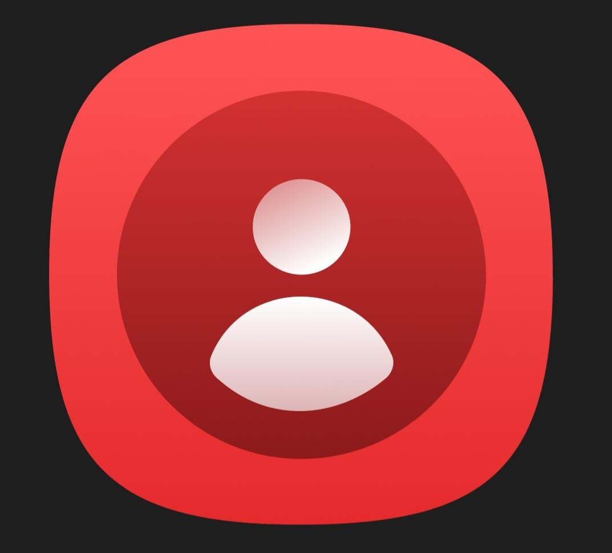

<div align="center">
  
  
  # Contacts (One UI Style)
  
  **Легковесный, автономный и функциональный менеджер контактов для Android, вдохновленный интерфейсом Samsung One UI.**

  [](LICENSE)
  [](https://android.com)
  [](https://kotlinlang.org)
  [](https://developer.android.com/jetpack/compose)
  [](https://m3.material.io)
</div>

---

## 📌 О проекте

Приложение разработано как чистая, быстрая и приватная альтернатива стандартным телефонным книгам. Никакой лишней рекламы, трекеров и облачных зависимостей — приложение работает напрямую с системной базой данных контактов Android (`ContactsContract`) и вызовами (`CallLog`).

---

## 🚀 Основные возможности

### 1. Управление контактами
* **Синхронизация с системой**: все добавленные, измененные или удаленные контакты моментально отображаются во всех других приложениях (звонилках, Telegram, WhatsApp, SMS).
* **Создание и редактирование**: имя, фамилия, номера телефонов с типами (мобильный, рабочий и т.д.), email, заметки.
* **Аватары**: установка любого фото из галереи с автоматической конвертацией в системный формат Android или генерация цветного аватара с инициалами.
* **Быстрый поиск**: живой поиск по имени, фамилии или номеру телефона с поддержкой русской и английской раскладок.
* **Избранное**: закрепление важных контактов вверху списка для быстрого доступа.

### 2. Карточка контакта и история вызовов
* **Детальный профиль**: быстрые кнопки для звонка, отправки SMS, видеозвонка и перехода в мессенджеры.
* **История звонков контакта**: полный журнал входящих, исходящих и пропущенных вызовов с указанием времени, длительности и использованной SIM-карты.
* **Индивидуальный фон профиля**: возможность установить персональные обои для экрана контакта.
* **Социальные сети**: сохранение ссылок на профили Telegram, VK, WhatsApp и веб-сайты.

### 3. Интеграция со звонками
* **Поддержка Dual SIM**: диалог выбора активной SIM-карты (SIM 1 / SIM 2) перед совершением вызова.
* **Встроенный номеронабиратель (Dialer)**: быстрый набор номеров прямо из приложения с T9-поиском.

---

## 🛠 Технический стек

* **Язык**: Kotlin 100%
* **UI-фреймворк**: Jetpack Compose (Material 3)
* **Архитектура**: MVVM + Single Activity Pattern
* **Асинхронность**: Kotlin Coroutines & StateFlow
* **Работа с данными**: Android `ContentResolver` (`ContactsContract`, `CallLog`, `TelephonyManager`)
* **Загрузка изображений**: Coil 3
* **Локализация**: Полная поддержка русского и английского языков

---

## 📱 Сборка и установка

### Требования:
* Android Studio Ladybug (2024.2+) или новее
* JDK 17+
* Минимальная версия Android (minSdk): **Android 8.0 (API 26)**
* Целевая версия Android (targetSdk): **Android 14 / 15 (API 34/35)**

### Сборка через Gradle:
```bash
# Клонировать репозиторий
git clone <url-репозитория>

# Собрать отладочный APK
gradle :app:assembleDebug
```

Готовый APK будет находиться по пути:
`app/build/outputs/apk/debug/app-debug.apk`

---

## 🔒 Разрешения (Permissions)

Приложение запрашивает только необходимые для работы телефонной книги права:
* `READ_CONTACTS` / `WRITE_CONTACTS` — для чтения и редактирования контактов.
* `READ_CALL_LOG` / `WRITE_CALL_LOG` — для отображения истории звонков.
* `CALL_PHONE` — для совершения прямых вызовов.
* `READ_PHONE_STATE` — для работы с несколькими SIM-картами.

---

## 📄 Лицензия (License)

Проект распространяется под свободной лицензией **GNU General Public License v3.0 (GPL-3.0)**. Полный текст условий доступен в файле [LICENSE](LICENSE).

